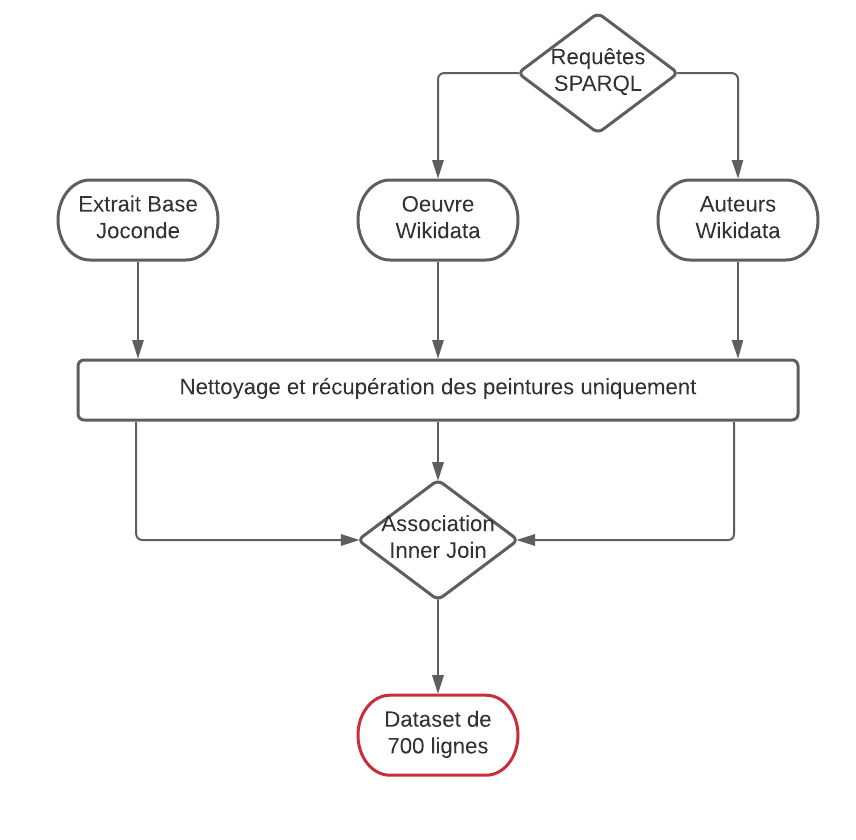

# Base Joconde Mashup
<div align="justify">
  
Ce dépôt contient un projet de mashup de données et leur visualisation autour d'un extrait de la Base Joconde, répertoriant les oeuvres d'art des musées français et accessible sur
[data.culture.gouv.fr](https://data.culture.gouv.fr/explore/dataset/base-joconde-extrait/information/). Ce travail est réalisé dans le cadre du cours de Science de la donnée du [Master 2](http://www.chartes.psl.eu/fr/cursus/master-technologies-numeriques-appliquees-histoire) Technologies numériques appliquées à l'Histoire de l'École nationale des Chartes.

## Réalisation du Mashup
<p align="center">
  
</p>

Pour une description détaillée du travail réalisé : [ici](https://github.com/Juliettejns/baseJocondeMashup/blob/documentation_nettoye/dataset/README.md)

## Visualisation
Nous avons réalisé trois tableaux de bord sur Tableau Public, ainsi qu'une visualisation sur Palladio (pour plus d'informations sur ces visualisation, cliquer [ici](https://github.com/Juliettejns/baseJocondeMashup/tree/main/datavisualisation)).

## Conclusion
Au cours de notre travail, il nous a été possible d'observer quelques grands phénomènes à partir de l'étude de notre dataset. Cependant, il est important de garder à l'esprit que celui-ci n'est pas représentatif de l'ensemble de la Base Joconde ni même de l'échantillon que nous avons récupéré. D'abord, le ressèrement du travail autour des peintures uniquement a induit une sureprésentation de l'Œuvre de Gustave Moreau et donc du musée éponyme ainsi que de la nationalité française de l'essentiel des artistes. De facto, le panel étudié est essentiellement composé d'oeuvres datant de la deuxième moitié du XIXe siècle même si le pic de création pour l'année 1851 reste remarquable. Cette chronologie explique la prédominance des genres représentés ainsi que l'appétance pour la technique de la peinture à l'huile qui domine la création artistique de l'époque. Enfin, c'est encore le musée Gustave Moreau et son historique qui éclairent la proportion des legs ainsi que le pic des acquisitions sous la forme de legs, au moment où le peintre a cédé le contenu de sa maison dans l'optique de sa conservation en 1897, volonté confirmée à son décès l'année suivante. Ainsi, notre travail offre une représentation assez fidèle de ce que peut constituer une collection picturale de la fin du XIXe siècle et de ses caractéristiques techniques et juridiques. 

Outre toutes les informations que cela peut nous apprendre sur les données récoltées, nous avons également beaucoup appris sur la création d'un mashup de données et sa transformation en datavisualisation. En effet, les données peuvent être très longues à nettoyer afin de s'assurer un rendu et une étude intéressante. De plus, l'ajout de données en provenance d'autres bases n'est pas toujours le plus aisé et peut parfois réduire drastiquement la quantité de celles-ci. A l'inverse, si cette réduction de données peut surprendre, l'amélioration de la qualité des données a été largement appréciable. Concernant la datavisualisation, même si tout n'a pas pu être fait dans le même cadre, nous avons pu voir voir avec intérêt toutes les possibilités que nous donnaient des données propres.

</div>

## Repository
```
├── dataset
│     ├── extraitJoconde
|     |    ├── baseJoconde_extrait.tar.xz
│     │    ├── baseJoconde_prepared.csv 
|     |    └── README.md
|     |
│     ├── wikiDataSPARQL
|     |    ├── query_auteurs.csv
|     |    ├── query_oeuvre.csv
|     |    ├── query_auteurs_prepared.csv
│     │    ├── query_oeuvre_prepared.csv
|     |    └── README.md
|     |
|     ├── base_joconde_oeuvres.csv
|     ├── base_joconde_oeuvres_auteurs.csv
|     └── README.md
|
├── datavisualisation
│     ├── 1_Présentation_générale
|     |    ├── Annee_creation_temps.png
|     |    ├── Carte_Musee.png
|     |    ├── Entree_base_temps.png
│     │    ├── Oeuvre_Artistes.png
|     |    └── README.md
|     |
│     ├── 2_Aspects_juridiques
|     |    ├── Annee_acquisition_temps.png
|     |    ├── Mode_acquisition.png
|     |    ├── Statut_juridique.png
|     |    └── README.md
|     |
│     ├── 3_Etude_genre
|     |    ├── Artistes_ecole.png
|     |    ├── Dimensions_genre.png
|     |    ├── Support_technique.png
|     |    └── README.md
|     |
│     ├── 4_Palladio
|     |    ├── Gallerie.json
|     |    └── README.md
|     └── README.md
|
├── images
|     └── ...
|
├── DevoirBaseJoconde_VersionPdf.pdf
|
└── README.md
```
## Crédits
Ce dépôt est développé par [Mathilde Liteau](http://github.com/mathildeliteau), [Claire Jahan](http://github.com/Heresta) et [Juliette Janes](http://github.com/Juliettejns), étudiantes de la promotion 2021 du Master 2 Technologies numériques appliquées à l'Histoire de l'École nationale des Chartes.

## Licence
Ce dépôt est CC-BY.</br>


## Contacts
Pour toute question: juliette.janes@chartes.psl.eu 
