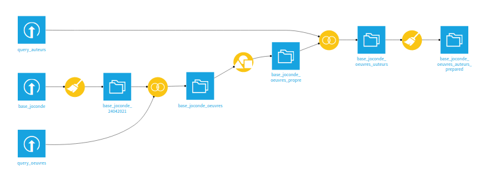

# Réalisation du mashup

  
  

  

## 1. Présentation des données
Le dataset de travail, [extrait de la Base Joconde](https://github.com/Juliettejns/baseJocondeMashup/tree/main/dataset/extraitJoconde/base-joconde-extrait.tar.xz), est composé de 60 000 lignes et 34 colonnes. Cette imposante taille a rendu le travail de nettoyage à réaliser particulièrement compliqué, notamment pour nos ordinateurs. La base a été remplie à la main, par chacun des musées, et, les colonnes pouvant contenir plusieurs informations différentes, les cellules ne sont pas du tout normalisées. Ainsi, face à la quantité d'informations difficiles à réorganiser et dans l'idée de réduire une étape chronophage, nous avons voulu récupérer des informations plus propres sur [Wikidata](https://www.wikidata.org/wiki/Wikidata:Main_Page).  
Nous avons donc obtenu deux fichiers csv. Le premier, sur les oeuvres de la Base Joconde contenues dans Wikidata, soit 15 759 éléments, présente à la fois des colonnes qui nous semblaient très compliquées à nettoyer dans notre dataset d'origine et des colonnes d'informations qu'il ne contenait pas, à l'instar des images des oeuvres. Le second, sur les auteurs des oeuvres de la base Joconde contenues dans Wikidata, est essentiellement composé d'éléments qui n'étaient dans la Base. La plupart des images récupérées dans Wikidata étant des images de peinture, nous avons décidé de nous focaliser sur celles-ci, dans l'idée de réaliser une visualisation mettant l'accent sur une gallerie d'images.  
Il aurait été également intéressant d'associer notre extrait de la Base Joconde, à la [base Muséofile](https://data.culture.gouv.fr/explore/dataset/musees-de-france-base-museofile/information/), qui répertorie les musées de France. Cette idée est d'autant plus intéressante que le set de données possède une colonne comprenant les identifiants Muséofile des musées, ce qui aurait permis de lier les deux fichiers csv facilement. Cependant, la base Muséofile est directement liée à la base Joconde et cette jointure n'aurait créé que des doublons.
## 2. Nettoyage des données
Le nettoyage des fichiers csv a été exclusivement réalisé sur [Dataiku](https://fr.wikipedia.org/wiki/Dataiku).

Pour une description détaillée du nettoyage de la Base Joconde: [ici](https://github.com/Juliettejns/baseJocondeMashup/tree/main/dataset/extraitJoconde/README.md). 
Pour une description détaillée des sets de données récupérés sur Wikidata: [ici](https://github.com/Juliettejns/baseJocondeMashup/tree/main/dataset/wikidataSPARQLRequests/README.md). 
## 3. Association des données
Une fois les trois sets de données nettoyés, il a fallu les associer. Pour ce faire, nous avions tout d'abord projeté de réaliser un _left join_. Cela permettait de conserver toutes les données de l'extrait de la Base Joconde correspondant aux peintures, et de leur associer, quand cela était possible, les informations récupérées sur Wikidata. Les données de l'extrait de la base ont été jointes aux oeuvres de Wikidata grâce à leurs identifiants. Par la suite, les données sur les auteurs ont été associées au dataset obtenu, grâce aux prénoms et noms que nous avions également récupérés, de la même façon, dans le fichier csv des oeuvres de Wikidata. Nous avons alors obtenu un csv de 17 000 lignes, dont seulement quelques petites centaines d'entre elles correspondaient aux données récupérées sur Wikidata. 
Nous avons alors réalisé que les données de l'extrait de la Base Joconde sur lesquelles nous avions travaillé et les données sur la base disponibles sur Wikidata ne coïncidaient absolument pas, ou alors très peu. Malgré cela, nous avons choisi de continuer à travailler dessus, en préférant faire un _inner-join_ des données, soit uniquement les données présentes à la fois dans notre extrait de la Base Joconde et dans Wikidata. Cela nous a donné un dataset d'environ 700 lignes. Cela nous a permis de récupérer un set de données dans lequel les données de Wikidata ne sont pas à peine visibles, sachant que celles-ci correspondent des colonnes assez importantes dans nos idées de visualisation.  
En dépit de la réduction drastique du dataset, qui n'est donc plus vraiment réprésentatif de la base Joconde, nous en avons finalement obtenu un nettoyé qui reste assez important pour réaliser des visualisations. Nous avons donc travaillé à la mise en graphiques et en images d'un dataset précis, correspondant à l'intersection entre un extrait de la Base Joconde et des données complétant celle-ci rendues accessible sur Wikidata. 

