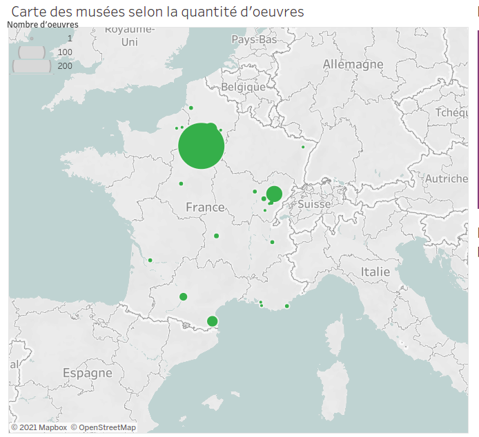
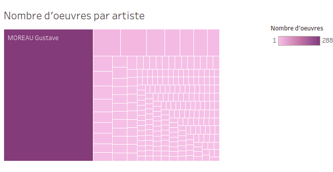
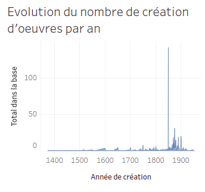

# Tableau de bord 1 : Présentation générale du dataset

Ce premier tableau de bord ([lien vers l'exemplaire sur Tableau Public](https://public.tableau.com/profile/jahan3241#!/vizhome/EtudesurdesdonnesrcupresdelaBaseJoconde/PrsentationgnraledesdonnesrcupressurlaBaseJoconde)) permet de donner un aperçu rapide des données de ce dataset, en mettant l'emphase sur les institutions de conservation, auteurs et périodes présents.

Le présent dépôt contient les visualisations réalisées, en format image (png), ainsi que le détail de leur création.
## Carte des musées
La carte des musées était un incontournable. Il était nécessaire de représenter la géographie de ces oeuvres par le biais de leur institution de conservation. Nous pouvons donc voir les différents clusters, les différents lieux "vides". Il nous est apparu important également de visualiser la quantité de ces oeuvres au sein de chaque endroit. Cela donne à voir l'importance de la représentativité des musées au sein de notre dataset. Pour ce faire, nous avons utiiisé les colonnes `latitude` et `longitude`, afin de localiser les musées sur une carte.

## Nombres d'oeuvres par artiste
Ce graphique donne à voir de la même manière que le précédent l'importance de chaque artiste dans notre dataset par rapport au nombre d'oeuvres qui lui correspondent.
Pour cette visualisation, nous avons mobilisé la colonne `nom des auteurs`.

## Date de création des oeuvres et de leur insertion dans la Base Joconde

Ces deux graphiques ont été ajoutés côte à côte dans le tableau de bord. L'idée est de montrer cette double temporalité qui a son importance, que pour savoir sur quel type d'oeuvres on peut avoir affaire, tant pour rendre compte de la temporalité de la constitution de la Base Joconde, ou du moins de ce que nous en avons extrait.

Nous avons utilisé, respectivement pour chacun des graphiques, les colonnes ``date de création`` et ``date d'entrée`` dans la base auquel nous avons associé le nombre total d'oeuvres de notre dataset.

Nous avions tout dans un premier temps, eu l'idée d'insérer ces deux types de données dans un même graphique, ce qui a donné ceci :

Les deux plages de dates ne correspondant pas, nous n'avons pas réussi à n'avoir qu'un seul axe des abcisses pour notre graphique. Ainsi, cette double axe des abcisses ne nous convenant pas, nous avons préféré, dans un souci de meilleure compréhension du graphique pour les personnes extérieures au projet, de nous en tenir à deux graphiques différents.

## Conclusion

Les deux premières visualisations ont pour but non seulement de permettre d'analyser les données présentées, mais également de rendre compte de ce que comprend notre dataset. Cela paraissait des plus importants afin de rendre compte à toute personne extérieure de ce à quoi il avait affaire. Cette dernière idée est légèrement moins présente concernant les deux derniers graphiques, qui donnent tout de même la fourchette temporelle des oeuvres de ce dataset, ainsi que celle de leur insertion dans la Base Joconde.

