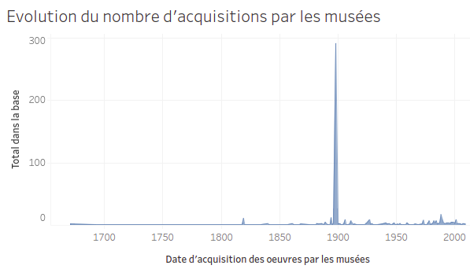
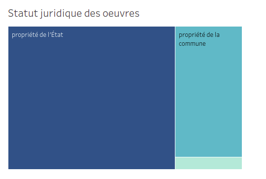
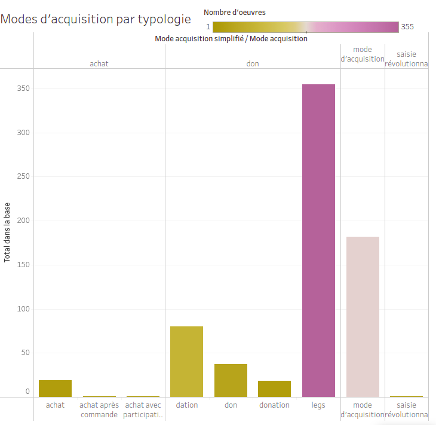

# Tableau de bord 2 : Aspects juridiques

  
Ce [second tableau de bord](https://public.tableau.com/profile/jahan3241#!/vizhome/EtudesurdesdonnesrcupresdelaBaseJoconde/AspectjuridiquedesdonnesrcupressurlaBaseJoconde) présente les différentes informations juridiques concernant les oeuvres, telles que les dates d'acquisition par le musée, les types de propriétaires et la méthode d'acquisition.

Le présent dépôt contient les visualisations réalisées, en format image (png), ainsi que le détail de leur création.

## Dates d'acquisition
Cette visualisation a pour simple but de montrer la temporalité de l'acquisition des oeuvres de notre dataset et son évolution. Elle a été construite en utilisant la colonne année d'acquisition auquel on a associé le nombre total d'oeuvres du dataset par date d'acquisition.

## Statut juridique des oeuvres
Cette visualisation a pour but de rendre les différentes possibilités de statut juridique des oeuvres. Il est intéressant de noter qu'il en existait d'autres, mais qu'elles ont disparu en deux temps : la première fois, lors du choix du domaine de la peinture et une seconde fois lors de la jonction avec les deux base de Wikidata.
Pour ce faire, nous avons utilisé la colonne statut_juridique associé au nombre total d'oeuvres par type de statut dans le dataset.

## Mode d'acquisition
En ce qui concerne cette visualisation, il nous paraissait important de la rendre la plus simple possible. C'est pour cette raison que nous avons décidé de bien séparer les différents modes d'acquisition en les regroupant en catégories. C'est pour cette raison que l'on retrouve "achat", "don", "mode d'acquisition inconnu" et "saisie révolutionnaire" sur la partie haute de la visualisation, tandis que sur la partie base, les chiffres sont explicités.

## Conclusion
Il nous paraissait important d'avoir cette vision juridique de nos données étant donné l'importance que cela avait dans la Base Joconde originelle.

