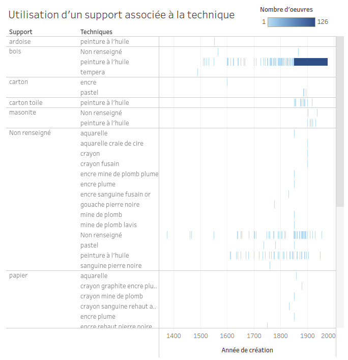
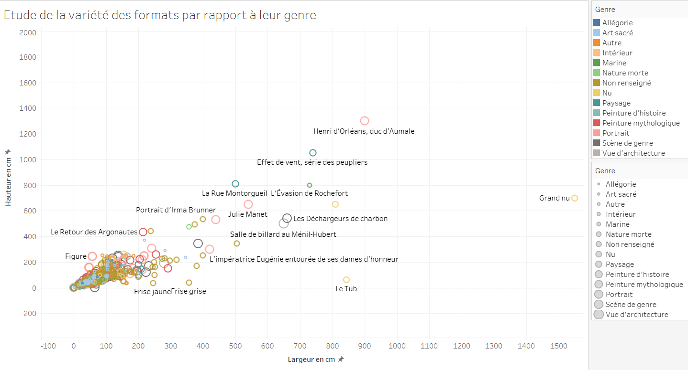
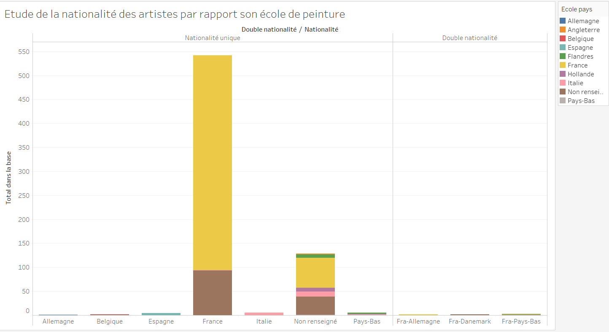

# Tableau de bord 3 : Étude du genre et de la matérialité des oeuvres

Ce dernier tableau de bord ([lien pour la visualisation](https://public.tableau.com/profile/jahan3241#!/vizhome/EtudesurdesdonnesrcupresdelaBaseJoconde/Etudesurlegenreetlamatrialit)) donne un aperçu des possibilités d'exploitation des données de notre dataset plus poussé, notamment en s'intéressant à la relation entre les dimensions et le genre de l'oeuvre, l'évolution des supports et techniques dans le temps ou encore en comparant les nationalités des auteurs et leur école.

Le présent dépôt contient les visualisations réalisées, en format images, ainsi que le détail de leur création.

## Évolution des supports et techniques de peinture dans le temps
Par cette visualisation, nous avions l'ambition de montrer au mieux la diversité des supports et des techniques qui leur sont associées. Ce qui était intéressant également était de montrer laquelle de ces associations était la plus représentée, et ce, au cours du temps.

## Relation entre les dimensions d'une oeuvre et son genre
Nous ne pensions pas du tout à réaliser cette association, mais nous souhaitons travailler au départ avec les dimensions des oeuvres au cours du temps. Cette représentation donne à voir le lien entre les dimensions et le genre de l'oeuvre. Cela permet également de voir si un portrait est bien en format portrait, ou une nature morte en format paysage.

## Comparaison entre les nationalités des peintres et leur école
Il paraissait des plus intéressant de faire le lien entre ces deux informations, afin d'avoir une idée de la mobilité des influences artistiques.

